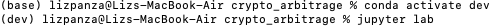

# Arbitrage Opportunities in Bitcoin and other Cryptocurrencies
Applying the three phases of financial analysis to determine if any arbitrage opportunities exist for Bitcoin.

1. Collect the data;
2. Prepare the data;
3. Analyze the data.

## Technologies

This project was developed with python 3.7 with the following packages:

* [pandas](https://github.com/pandas-dev/pandas) - Providing fast, flexible, and expressive data structures designed to make working with "relational" or "labeled" data both easy and intuitive.

* [pathlib](https://docs.python.org/3/library/pathlib.html) - Is a Python module which provides an object API for working with files and directories.

* [matplotlib](https://github.com/matplotlib/matplotlib)- Is a comprehensive library for creating static, animated, and interactive visualizations in Python. Matplotlib makes easy things easy and hard things possible.

And as well I used [Jupyter Lab](https://github.com/jupyter/notebook) notebook to develope it.

---

## Installation Guide

Before running the application it is necessary to install the following dependencies.

* pandas
```conda install pandas```
* pathlib
```pip install pathlib``` 
* matplotlib
```conda install matplotlib```
* Jupyter Notebook
```pip install notebook```

---

## Usage

To use the application you will need to clone the repo into your machine, navigate on terminal into it and open your [Jupyter Lab](https://github.com/jupyter/notebook) to run the file **crypto_arbitrage.ipynb**: 




---

## Contributors

This was a project developed as a group during a Fintech Bootcamp hosted by UC Berkley Extension. 

---

## License
MIT
